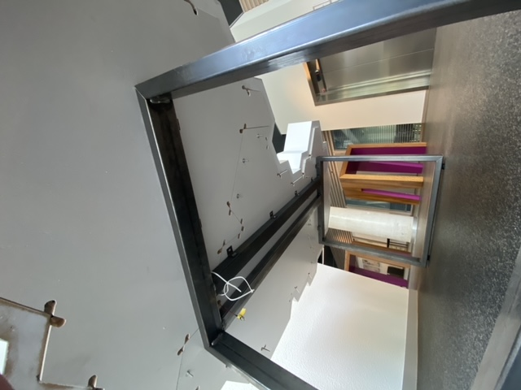
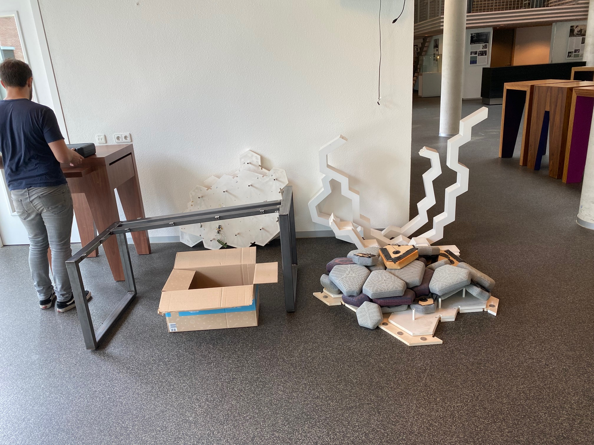
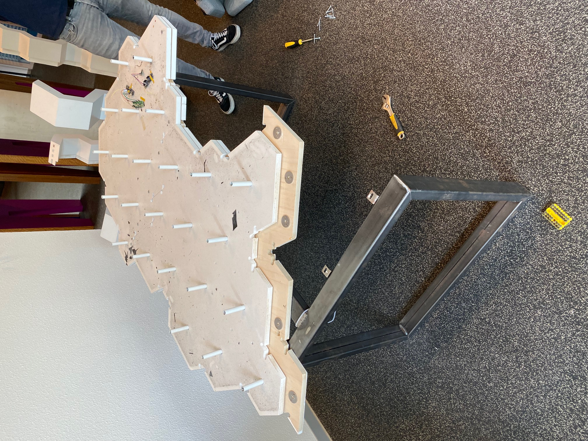
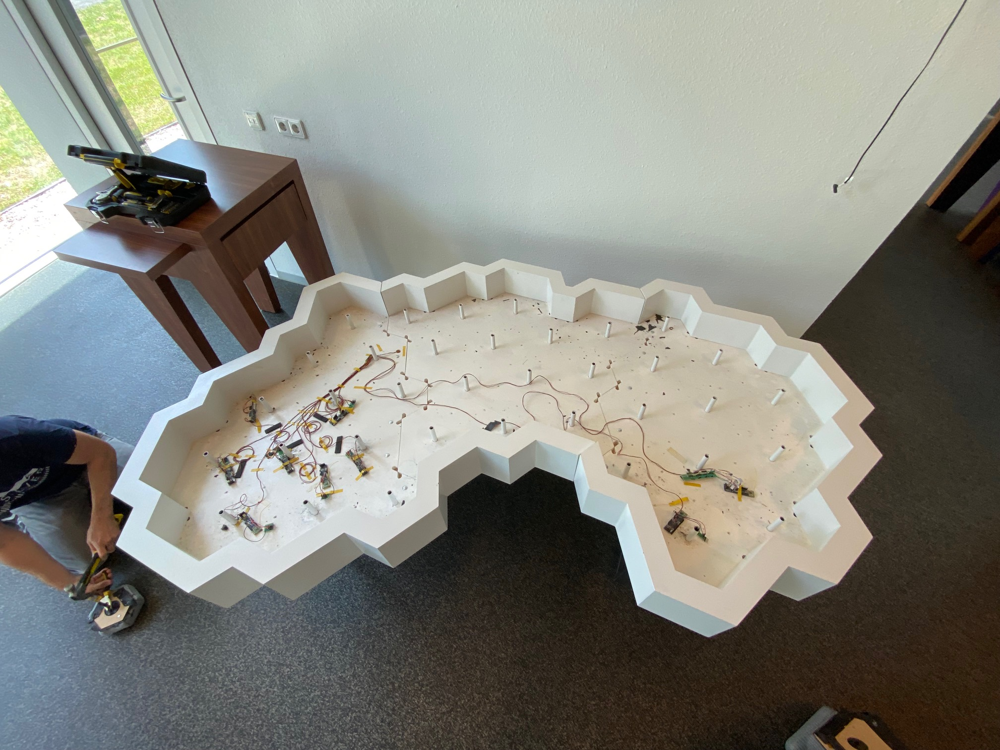
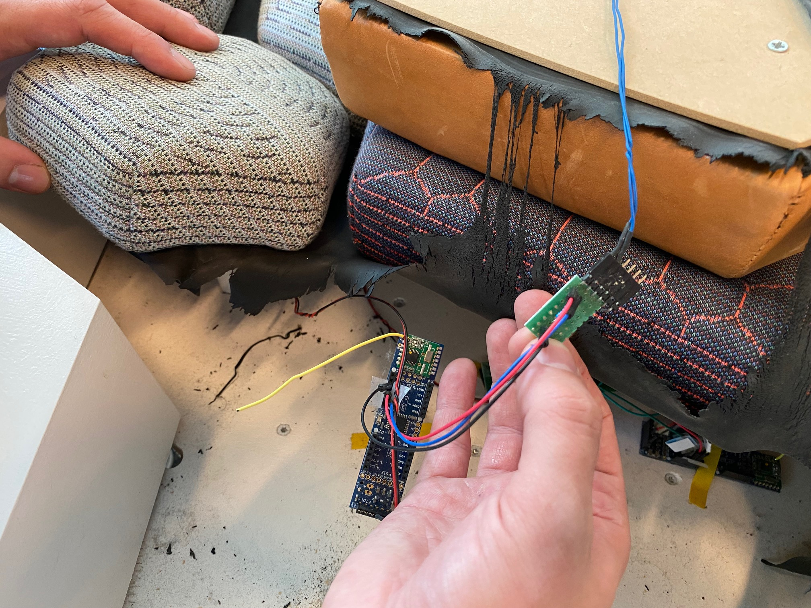
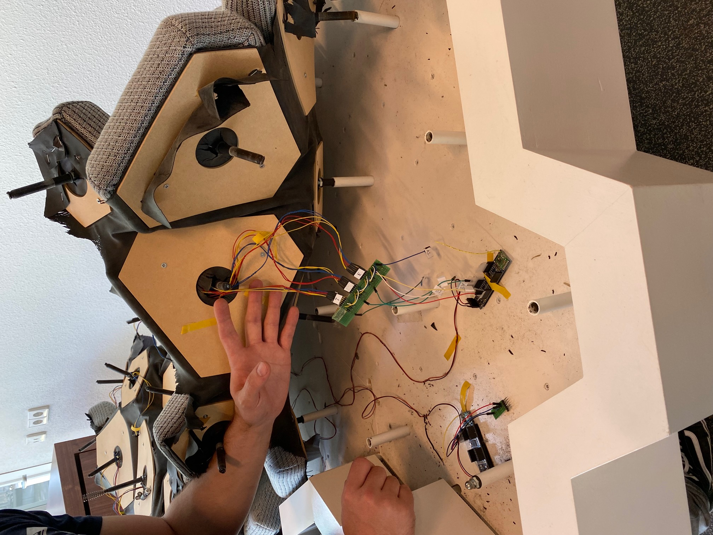

# Reviving the Volvo hardware

These instructions (and the referenced video) come from <https://github.com/cwi-dis/volvo>, which also contains all the source code to the software, plus some schematics, background information etc.


## Parts list
 
You should have the following parts before you start:

- The table
- Power supply to the table (5V, 2A, tip positive)
- Raspberry PI 2B
- 16GB Flash card
- Jeenode JeeLink USB 822MHz receiver
- Raspberry PI power supply
- HDMI monitor (preferably portrait orientation)
- Ethernet connection


Here is a quick walkthrough video of the hardware in operation: [VolvoHardwareWalkthrough.mp4](VolvoHardwareWalkthrough.mp4)

(visit the website, above, if you cannot see this video).

## Table reconstruction (old)

The table legs can come off, and the table can be split into three parts. If that has happened you need to put it together again. If the table has been split into three parts you will also need to re-connect to power distribution to all of the sensors boards. Hopefully things have been clearly labeled.

Here is a picture of the table from below. It may give you an idea on how to re-assemble it if you have to do that:



Connect the table to its power supply and plug it in. It _may_ be possible to see some of the indicator lights on the sensor boards light up, if you peek under the touch surfaces.


## Table Reconstruction (July 2023)

It turns out we had to take the table apart. Here is a picture of the bits you need to find:



First you need to connect the three parts of the table floor, using the provided bolts. Here is a picture of the first two parts connected. Notice the marker "1" on both the table floor piece and base. You need to align these.



After connecting the third part of the table floor affix it to the base using the screws. Now you can attach the three pieces of the table rim. It should now look like this:



Connect the power routing. From the central power distribution board there are red/black wires to every sensor controller board. Check the picture above (or one of the ones below) for how to connect.

Next you need to reconstruct the top cover. Lay it upside-down on the floor. Insert all the rods. Start inserting the rods into the table from the middle: the light grey tiles that have no sensors.

Attach the sensors in the tiles to the sensor controller boards. Here is a picture of the volume tile  connection (right side of the table):


And a picture of the hand tile connection:



Here is a picture of the sensor tile connections on the left hand side of the table:



There are a number of other pictures in this folder (on github), check them out if things are unclear.

Next connect the power supply and hope for the best.

## Raspberry PI re-creation

If you have all the components listed above: skip this section, try the "putting it all together" section, and just hope it works.

### Re-creating the Flash card

If you have the 16GB Flash card and it works: you should be all set. But the card will probably die in a few years.

If you need to re-create the flash: get a 16GB Flash card and copy the file `rpi2-byBorreVolvo-20230703-image.dd` to it **verbatim**. I.e. do a raw copy.

To get this image: contact the DIS group at Centrum voor Wiskunde & Informatica. It is located on the archival disk `DisArch2021` in `Special Disk Images`.

Something like `dd` to the raw device will work on MacOS or Linux (after you find the correct NNN in the command below, using `diskutil list`). Get a Linux or MacOS geek to help you with these steps.

```
sudo dd if=rpi2-byBorreVolvo-20230703-image.dd of=/dev/rdiskNNN bs=1M
```
 

### Checking the PI

If you have lost the Raspberry PI get another RPI Model 2B. They are all the same. Insert the card.

Connect the PI to an ethernet. It will show up as `volvo.local`. Login as user `pi`, password `borre`.

### JeeLink

If the JeeLink is lost that is a problem: they are no longer available. You could try contacting the Distributed and Interactive Systems group at Centrum Wiskunde en Informatica to see if they have one lying around.

## Putting it all together

Plug the Jeelink into the PI. Plug the HDMI display into the PI. Plug the Ethernet into the PI. Plug the power supply into the PI. Connect the power supply to an outlet.

The PI and the table communicate wirelessly, and they don't have to be too close to each other, 10 meter should be fine, 100 meter is probably pushing it.

## It does not work

You best bet is to contact the CWI DIS group to see if anyone there can help you. Otherwise: this repository does contain all needed software, source code, hardware shcmatics, etc. But it was never intended to make it easy to find all the information, sorry.